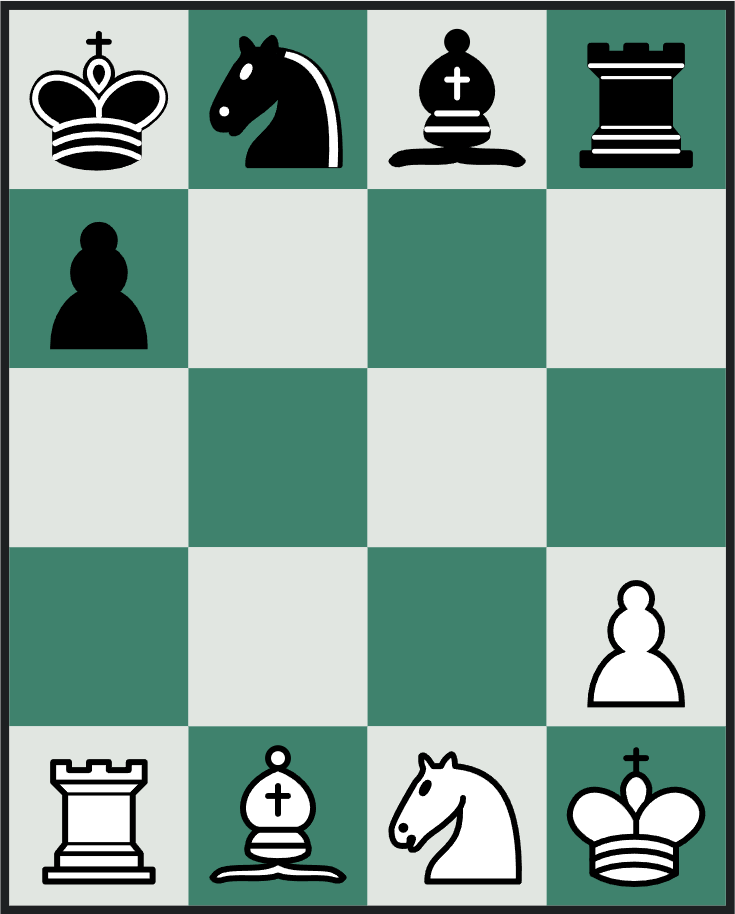

# MicroChess by [Ajlal](https://github.com/AJP-432) and [Amaan](https://github.com/Amaan-N-K)

This is our game engine for the popular [microchess](https://en.wikipedia.org/wiki/Minichess) game (a simplified version of chess). This project written in Python contains the game engine and enables local 1v1. We then add AI opponents using MiniMax and Reinforcement Learning.

